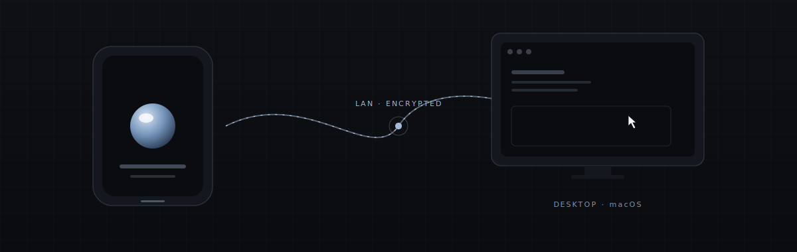

<div align="center">

<picture>
  <source media="(prefers-color-scheme: dark)" srcset="readme/banner-dark.svg">
  <source media="(prefers-color-scheme: light)" srcset="readme/banner-light.svg">
  
</picture>

<br>

[](LICENSE)
[](apps/desktop)
[](apps/mobile)
[](apps/mobile)
[](https://github.com/gabrieldonadel/entangle/stargazers)

<br>

**Turn your phone into a trackpad for your Mac.**
Free, open‑source, zero‑setup. Stays on your Wi‑Fi, never leaves the room.

<br>

[**↓ Download**](#-install) · [**⚡ Quick start**](#-quick-start) · [**🛠 Hack on it**](#-development) ·

</div>

<br>

---

## ✨ Why Entangle?

You're across the room. The Mac is plugged into the TV. The keyboard is buried under cables. **Pick up your phone instead.**

|     | Feature                 | What you get                                                       |
| --- | ----------------------- | ------------------------------------------------------------------ |
| 🖱  | **Trackpad mode**       | Smooth, sub‑frame pointer with two‑finger scroll & tap‑to‑click.   |
| ⌨️  | **Keyboard relay**      | Type from your phone. Modifier keys, arrows, the works.            |
| 🔒  | **LAN‑only by default** | No accounts, no cloud, no telemetry. Pairs over the local network. |
| 📡  | **Auto‑discovery**      | Bonjour / mDNS finds your Mac the moment the app opens.            |
| 🌓  | **Native everywhere**   | React Native macOS on desktop, Expo on mobile. One repo.           |

<br>

## 🔌 How it works

<div align="center">
  
</div>

<br>

The mobile app advertises itself over **Bonjour / mDNS**. The desktop daemon listens on the LAN, the phone connects, and from then on every gesture is a tiny WebSocket frame on your local network. **No relay servers. No internet required.** If your router goes down, Entangle keeps working.

The wire format is a single shared TypeScript package — [`@entangle/protocol`](packages/shared) — imported by both clients, so the desktop and the phone can never disagree about what a message looks like.

<br>

## 📥 Install

### From a release

> Pre‑built binaries are coming soon. Star ⭐ the repo to get notified.

| Platform                  | Download                                                                         |
| ------------------------- | -------------------------------------------------------------------------------- |
| **macOS** (Apple Silicon) | [`Entangle.dmg`](https://github.com/gabrieldonadel/entangle/releases)            |
| **iOS**                   | TestFlight — see [Releases](https://github.com/gabrieldonadel/entangle/releases) |
| **Android**               | [`entangle.apk`](https://github.com/gabrieldonadel/entangle/releases)            |

### Build from source

See [**Quick start**](#-quick-start) below.

<br>

## ⚡ Quick start

```sh
# 1. Clone
git clone https://github.com/gabrieldonadel/entangle.git
cd entangle

# 2. Install the root workspace (this only sets up packages/shared)
pnpm install

# 3. Install each app on its own (apps live outside the root workspace)
cd apps/desktop && pnpm install --ignore-workspace && cd -
cd apps/mobile  && pnpm install --ignore-workspace && cd -

# 4. CocoaPods for the desktop app (first clone only)
cd apps/desktop/macos && bundle install && bundle exec pod install && cd -

# 5. Run the desktop app
pnpm desktop:start    # in one terminal — Metro on port 8090
pnpm desktop:macos    # in another     — build & launch the macOS app

# 6. Run the mobile app
pnpm mobile:start     # Expo dev server
pnpm mobile:ios       # iOS simulator / device
pnpm mobile:android   # Android emulator / device
```

That's it. The phone will find the Mac on its own — pick it from the discovered list and start moving the pointer. macOS will ask for **Accessibility** permission the first time; the desktop UI is gated until you grant it.

<br>

## 🧰 Requirements

|                   |                                                                                  |
| ----------------- | -------------------------------------------------------------------------------- |
| **Node.js**       | ≥ 18                                                                             |
| **pnpm**          | 10.x                                                                             |
| **Xcode**         | 15+ (for iOS & macOS builds)                                                     |
| **CocoaPods**     | `bundle install && bundle exec pod install` inside `apps/desktop/macos`          |
| **Accessibility** | macOS Accessibility permission — required to synthesize pointer / keyboard input |

<br>

## 📦 What's in the box

```text
entangle-monorepo/
├─ apps/
│  ├─ desktop/      ← React Native macOS 0.81 + Expo 55  (the macOS server)
│  ├─ mobile/       ← Expo 55 + Expo Router + RN 0.83    (iOS / Android client)
│  └─ website/      ← Vite + React 18                    (marketing site)
├─ packages/
│  └─ shared/       ← @entangle/protocol — shared wire format (TypeScript)
├─ pnpm-workspace.yaml
└─ pnpm-lock.yaml
```

| App     | Path                           | Platforms     | Stack                                         |
| ------- | ------------------------------ | ------------- | --------------------------------------------- |
| Desktop | [`apps/desktop`](apps/desktop) | macOS         | React Native macOS 0.81 + Expo 55, React 19.1 |
| Mobile  | [`apps/mobile`](apps/mobile)   | iOS / Android | Expo 55 + Expo Router + RN 0.83, React 19.2   |
| Website | [`apps/website`](apps/website) | Web           | Vite + React 18                               |

> **Why are the apps outside the pnpm workspace?** Desktop and mobile pin different React / React Native versions. With pnpm's default symlink layout Metro's resolver walks across the symlinked workspace and picks up the wrong copy of `react-native`. Each app does its own install with `--ignore-workspace` against its own `pnpm-lock.yaml`, while `@entangle/protocol` is consumed via `link:../../packages/shared` and TypeScript `paths`.

<br>

## 🛠 Development

```sh
pnpm lint                               # eslint across every workspace
pnpm desktop test                       # jest (desktop unit tests)
pnpm desktop test -- path/to/file.test  # single test file
pnpm desktop <cmd>                      # forward any command into apps/desktop
pnpm mobile <cmd>                       # forward any command into apps/mobile
```

[`packages/shared`](packages/shared) is the source of truth for messages on the wire — touch it once, both clients update. All wire messages carry `v: 1`; bump `PROTOCOL_VERSION` for breaking changes and the server will close mismatched clients with code `4001`.

<br>

## 🗺 Roadmap

- [x] Trackpad + scroll + tap‑to‑click
- [x] Keyboard relay
- [x] mDNS auto‑discovery
- [x] Dock enumeration & app activation
- [ ] Media keys & system shortcuts
- [ ] Windows desktop client
- [ ] Apple Watch quick‑actions

See [open issues](https://github.com/gabrieldonadel/entangle/issues) for the live picture.

<br>

## 🤝 Contributing

PRs welcome — small fixes don't need an issue first. For anything bigger, [open an issue](https://github.com/gabrieldonadel/entangle/issues/new) and let's chat.

1. Fork & branch (`feat/your-thing`)
2. `pnpm install` at the root, then `pnpm install --ignore-workspace` inside any app you'll be touching
3. Commit with [Conventional Commits](https://www.conventionalcommits.org/)
4. Open a PR against `main`

<br>

## 📄 License

MIT © [Gabriel Donadel](https://github.com/gabrieldonadel). See [LICENSE](LICENSE) for details.

<br>

---

<div align="center">

Enjoying Entangle? [Drop a ⭐](https://github.com/gabrieldonadel/entangle).

<sub>Made with React Native macOS + Expo · No trackers · No analytics · No nonsense</sub>

</div>
